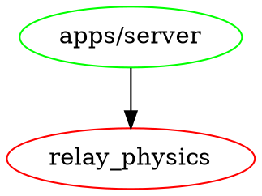

# RELAYSIM - MOCK BACKEND IMPLEMENTATION

**Purpose:** Build minimal Relay backend for immediate use  
**Audience:** Backend developers  
**Time:** 2-3 days implementation  
**Status:** 🔒 Locked

---

## 🎯 WHAT IS RELAYSIM?

**RelaySim is a thin mock backend that:**
- Implements minimal Relay physics (append-only, deterministic)
- Serves docs/TOC as first-class objects
- Enables graph export for repo analysis
- Lets you USE Relay immediately (without full backend)

**NOT:**
- Production-ready
- Fully featured
- Replacing the real backend

**Purpose:** Unblock work while full backend is being built.

---

## 🏗️ ARCHITECTURE

```
RelaySim/
├── event_store/          (JSONL append-only storage)
│   ├── filaments/
│   │   ├── {filament_id}.jsonl
│   │   └── ...
│   └── index.json        (lightweight filament index)
├── projections/          (Derived state cache - optional)
├── docs/                 (Points to relay/ directory)
├── api/                  (HTTP endpoints)
│   ├── commit.rs
│   ├── filament.rs
│   ├── state.rs
│   ├── docs.rs
│   ├── toc.rs
│   └── events.rs
└── graphs/               (Export graph generation)
    ├── workspace.rs
    ├── commits.rs
    └── routes.rs
```

---

## 📋 IMPLEMENTATION CHECKLIST

### **Phase 1: Core Physics (Priority 1)**

**Slice 1: Event Store**
- [ ] Create `filaments/` directory
- [ ] Implement `append_commit(filament_id, payload)`
- [ ] Implement `read_commits(filament_id)`
- [ ] Test: Append 3 commits → file has 3 lines

**Slice 2: Deterministic Replay**
- [ ] Implement `derive_state(filament_id)`
- [ ] Load commits, apply each to state
- [ ] Test: Replay twice → assert states equal

**Slice 3: SSE Event Stream**
- [ ] Implement `tokio::sync::broadcast` channel
- [ ] Emit `COMMIT_APPENDED` on every append
- [ ] Serve `/events` SSE endpoint
- [ ] Test: Connect → append → verify event received

---

### **Phase 2: Docs Serving (Priority 2)**

**Slice 4: Serve Docs**
- [ ] Load `CONTEXT-TABLE.json`
- [ ] Map `doc_id` → file path
- [ ] Serve `GET /docs/:doc_id`
- [ ] Test: Request doc → verify content matches

**Slice 5: Serve TOC**
- [ ] Load `filaments/toc/toc.jsonl`
- [ ] Parse latest commit
- [ ] Serve `GET /toc/latest`
- [ ] Test: Verify frozen flag, checksums

---

### **Phase 3: Graph Export (Priority 3)**

**Slice 6: Ingest Git Repo**
- [ ] Run `git log --all --format=...`
- [ ] Parse commits into RepoFilament
- [ ] Store as `filaments/repo_{name}.jsonl`
- [ ] Test: Verify commit count matches git

**Slice 7: Generate Workspace Graph**
- [ ] Parse `Cargo.toml` (or equivalent)
- [ ] Identify workspace members
- [ ] Check which exist on disk
- [ ] Export as GraphViz .dot
- [ ] Test: Generate graph → visual inspection

**Slice 8: Generate Route Map**
- [ ] Parse backend source files
- [ ] Extract API routes (axum/express)
- [ ] Map routes → handlers → filaments
- [ ] Export as GraphViz .dot
- [ ] Test: Generate graph → verify routes present

---

## 🔧 MINIMAL CODE EXAMPLE (RUST)

### **Event Store:**

```rust
use std::fs::{self, OpenOptions};
use std::io::Write;
use serde::{Serialize, Deserialize};

#[derive(Serialize, Deserialize)]
struct Commit {
    commit_ref: String,
    filament_id: String,
    commit_index: u32,
    payload: serde_json::Value,
    causal_refs: Vec<String>,
    timestamp: u64,
}

pub fn append_commit(
    filament_id: &str,
    payload: serde_json::Value,
    causal_refs: Vec<String>
) -> Result<Commit, std::io::Error> {
    let filament_path = format!("event_store/filaments/{}.jsonl", filament_id);
    
    // Determine next commit index
    let commit_index = if std::path::Path::new(&filament_path).exists() {
        let content = fs::read_to_string(&filament_path)?;
        content.lines().count() as u32
    } else {
        0
    };
    
    let commit = Commit {
        commit_ref: format!("{}@c{}", filament_id, commit_index),
        filament_id: filament_id.to_string(),
        commit_index,
        payload,
        causal_refs,
        timestamp: current_timestamp(),
    };
    
    // Append to JSONL
    let mut file = OpenOptions::new()
        .create(true)
        .append(true)
        .open(&filament_path)?;
    
    writeln!(file, "{}", serde_json::to_string(&commit)?)?;
    
    Ok(commit)
}

pub fn read_commits(filament_id: &str) -> Result<Vec<Commit>, std::io::Error> {
    let filament_path = format!("event_store/filaments/{}.jsonl", filament_id);
    
    if !std::path::Path::new(&filament_path).exists() {
        return Ok(vec![]);
    }
    
    let content = fs::read_to_string(&filament_path)?;
    let commits: Vec<Commit> = content
        .lines()
        .filter_map(|line| serde_json::from_str(line).ok())
        .collect();
    
    Ok(commits)
}
```

---

### **API Endpoint:**

```rust
use axum::{
    routing::{get, post},
    Json, Router,
};

#[tokio::main]
async fn main() {
    let app = Router::new()
        .route("/api/relay-physics/commit", post(append_commit_handler))
        .route("/api/relay-physics/filament/:id", get(read_filament_handler))
        .route("/api/relay-physics/state/:id", get(derive_state_handler))
        .route("/api/relay-physics/docs/:id", get(serve_doc_handler))
        .route("/api/relay-physics/toc/latest", get(serve_toc_handler))
        .route("/api/relay-physics/events", get(sse_handler));
    
    let listener = tokio::net::TcpListener::bind("127.0.0.1:3000")
        .await
        .unwrap();
    
    axum::serve(listener, app).await.unwrap();
}

async fn append_commit_handler(
    Json(payload): Json<CommitPayload>
) -> Json<Commit> {
    let commit = append_commit(
        &payload.filament_id,
        payload.data,
        payload.causal_refs
    ).unwrap();
    
    Json(commit)
}
```

---

## 📊 GRAPH EXPORT EXAMPLES

### **Workspace Graph (GraphViz):**

```rust
pub fn generate_workspace_graph(workspace_path: &str) -> String {
    let manifest = parse_cargo_toml(workspace_path);
    
    let mut dot = String::from("digraph workspace {\n");
    
    for member in &manifest.workspace.members {
        let exists = std::path::Path::new(&format!("{}/{}", workspace_path, member)).exists();
        let color = if exists { "green" } else { "red" };
        
        dot.push_str(&format!("  \"{}\" [color={}];\n", member, color));
    }
    
    // Add dependencies
    for member in &manifest.workspace.members {
        let deps = get_dependencies(member);
        for dep in deps {
            dot.push_str(&format!("  \"{}\" -> \"{}\";\n", member, dep));
        }
    }
    
    dot.push_str("}\n");
    dot
}
```

**Output:**


**This immediately shows: `relay_physics` is referenced but doesn't exist.**

---

## 🎯 SUCCESS CRITERIA

**RelaySim is complete when:**
- [ ] Can append commits via API
- [ ] Can read filaments via API
- [ ] Can derive state deterministically
- [ ] Can serve all docs via API
- [ ] Can serve TOC with checksums
- [ ] Can stream events via SSE
- [ ] Can ingest git repo
- [ ] Can export 3 graphs (workspace, commits, routes)

**Time estimate:** 2-3 days for experienced Rust/Node developer

---

## 🚀 USAGE WORKFLOW

### **Day 1: Build RelaySim**
```bash
cd relay/apps/relaysim
cargo run
# Server starts on http://localhost:3000
```

### **Day 2: Ingest Developer Repo**
```bash
curl -X POST http://localhost:3000/api/ingest-repo \
  -d '{"repo_path": "/path/to/developer/repo"}'
```

### **Day 3: Generate Graphs**
```bash
curl http://localhost:3000/api/graphs/workspace > workspace.dot
dot -Tpng workspace.dot > workspace.png
# Open workspace.png → see what's missing
```

---

## 📋 GRAPH INTERPRETATIONS

### **Workspace Reality Map:**
- **Green nodes:** Exist on disk
- **Red nodes:** Declared but missing
- **Edges:** Dependencies

**What to look for:**
- Red nodes with many incoming edges = critical missing work
- Isolated green nodes = dead code to delete
- Cycles = circular dependencies to break

### **Causal Commit Spine:**
- **Nodes:** Git commits
- **Edges:** Parent links
- **Tags:** "introduced missing dep", "deleted module"

**What to look for:**
- Exact commit where structure broke
- Who made the breaking change
- What was deleted vs what's still referenced

### **Route/Surface Map:**
- **Nodes:** API routes
- **Edges:** Route → handler → filament writes

**What to look for:**
- Routes that don't write to filaments = not Relay
- Routes with random IDs = not deterministic
- Routes without causal_refs = not traceable

---

## ⚠️ WHAT RELAYSIM WILL REVEAL

**Common developer traps RelaySim exposes:**

1. **"I'm building CRUD, not Relay"**
   - Routes do mutations instead of appends
   - No event stream
   - State stored, not derived

2. **"I'm building features, not physics"**
   - Randomness in IDs
   - No determinism tests
   - No replay capability

3. **"I'm stuck in old patterns"**
   - SQL database instead of JSONL
   - ORM instead of event sourcing
   - REST instead of event-driven

**Graphs make this undeniable.**

---

## 🎯 NEXT STEPS AFTER RELAYSIM

**Once RelaySim works:**
1. Use it daily (serve docs, append commits)
2. Generate graphs weekly (track progress)
3. Transition to real backend (slice by slice)
4. Keep RelaySim as test oracle

**RelaySim becomes the reference implementation.**

---

**Refs:** [c0.Filaments], [c1.Commits], [c2.Replay], [c3.Layers], [c5.RenderSpec]  
**Objects:** [Commit], [Filament], [RenderSpec]  
**Audit:** [Determinism], [Completeness], [Traceability]

**END OF RELAYSIM GUIDE**
