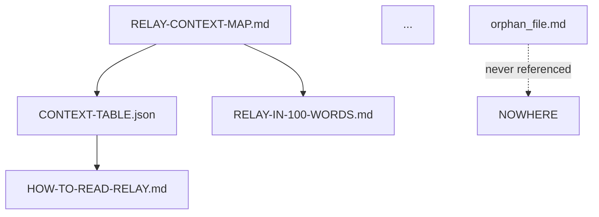

# SYSTEMATIC CLEANUP PROCESS

**Purpose:** Reduce entropy around preserved causal core  
**Status:** Ready to execute  
**Date:** 2026-01-29

---

## 🎯 WHAT THIS IS

**This is NOT casual cleanup.**

**This IS:**
- Systematic reduction of entropy
- Preservation of truth, history, intent
- Elimination of redundancy and parallel explanations
- Compacting the universe around immutable core

**We are not deleting meaning.**  
**We are organizing it correctly.**

---

## ✅ PREREQUISITES (VERIFIED)

**Before beginning, verify these are complete:**
- ✅ Core physics locked (c0-c16)
- ✅ TOC frozen as filament commit (`toc@c0`)
- ✅ Genesis filaments preserved (Prompt, Conversation, Evidence)
- ✅ CONTEXT-TABLE.json exists and is authoritative
- ✅ Language baseline locked
- ✅ Human freeze acknowledged

**All prerequisites met. Safe to proceed.**

---

## 📂 CLASSIFICATION SYSTEM (A-F)

**Every file must be assigned exactly ONE category:**

### **A. CORE (IMMUTABLE)**
**Rule:** Must never be modified except via new filament commit

**Criteria:**
- If removed, Relay becomes unreconstructible
- Referenced by TOC filament commit
- Part of architecture, genesis, or master navigation

**Examples:**
- `filaments/architecture/*` (all c0-c16)
- `filaments/toc/toc.jsonl`
- `reference/MASTER-PROMPT-SPECIFICATION.md`
- `reference/MASTER-CONVERSATION-SPECIFICATION.md`
- `reference/GENESIS-EVIDENCE-PACK-SPECIFICATION.md`
- `reference/CONTEXT-TABLE.json`
- `RELAY-CONTEXT-MAP.md`

**Action:** Lock, verify checksum, never modify

---

### **B. CANONICAL SUPPORT (ACTIVE)**
**Rule:** Must be referenced in CONTEXT-TABLE.json, no duplication

**Criteria:**
- Used directly by readers or implementers
- Part of active documentation
- Single source of truth for its domain
- No duplicate definitions of core objects/concepts

**Examples:**
- `reference/RELAY-OBJECTS-REFERENCE.md`
- `reference/HOW-TO-READ-RELAY.md`
- `guides/WORK-IN-RELAY.md`
- `guides/RELAY-DEVELOPER-GUIDE.md`
- `AUDITOR-GUIDE-RELAY-GAPP.md`
- `implementation/THIN-SLICE-DEFINITION.md`
- `implementation/RELAYSIM-MOCK-BACKEND.md`

**Action:** Verify in CONTEXT-TABLE, check for duplicates, keep active

---

### **C. HISTORICAL EVIDENCE (PRESERVE, MOVE)**
**Rule:** Preserve verbatim, move out of active path

**Criteria:**
- Messy, fragmented, but valuable for understanding
- Shows why Relay exists
- Part of genesis but not runtime truth
- Not needed for implementation
- Archaeological value

**Examples:**
- Word docs (early notes)
- Early markdown drafts
- ChatGPT conversation exports
- Claude conversation exports
- Sketches, partial schemas
- Screenshots of broken builds
- Email threads, Slack exports

**Target Location:**
```
relay/history/
├── raw_conversations/
├── early_notes/
├── abandoned_structures/
├── screenshots/
└── README.md (why this exists)
```

**Action:** Move to `history/`, preserve verbatim, document in README

---

### **D. SUPERSEDED (DEPRECATE)**
**Rule:** Must appear in DEPRECATED.md with replacement pointer

**Criteria:**
- Correct ideas, wrong structure
- Replaced by better expression
- Old summaries, status docs
- Redundant architecture explanations
- "LOCKED" notes now subsumed

**Examples:**
- Early architecture summary docs (before filament structure)
- Status reports (progress updates)
- Redundant "what is Relay" explanations
- Old PR specifications (if merged into canonical)
- Documents that overlap with newer canonical versions

**Action:** Add to DEPRECATED.md, remove from CONTEXT-TABLE, keep file for history

---

### **E. PROJECTIONS / SCENARIOS (OPTIONAL, LABELED)**
**Rule:** Explicitly labeled as optional, never required to understand Relay

**Criteria:**
- Stress tests, thought experiments
- Optional lenses
- Scenario planning
- Not core to understanding Relay
- Never referenced by core architecture

**Examples:**
- `scenarios/PLANETARY-READINESS-SCENARIO.md`
- Future: pandemic response scenario
- Future: AI emergence scenario
- Future: disaster coordination scenario

**Action:** Verify labeled correctly, ensure CONTEXT-TABLE marks as optional

---

### **F. DELETE (YES, ACTUALLY DELETE)**
**Rule:** If it teaches nothing and proves nothing → remove

**Criteria:**
- Drafts that never became true
- Incorrect information
- No unique insight
- Not evidence of the process
- Dead weight

**Examples:**
- Temporary test files
- Duplicate copies with no differences
- Incomplete drafts with no unique content
- Autogenerated cruft (node_modules, etc.)
- Empty or placeholder files

**Action:** Delete permanently (after Phase 1 inventory)

**This category should be small, but it must exist.**

---

## 🔄 THE 8-PHASE PROCESS

### **PHASE 1: INVENTORY (NO EDITS)**

**Goal:** Know what exists

**Agent Task:**
1. Recursively list every file in `relay/` directory
2. Record for each file:
   - Path (relative to relay/)
   - File type (md, json, jsonl, docx, png, etc.)
   - Last modified date
   - File size
   - Referenced by (grep through all docs for mentions)
3. Output: `FILE-INVENTORY.json`

**No decisions. No edits. Just data.**

**Deliverable:**
```json
{
  "inventory_date": "2026-01-29T...",
  "total_files": 89,
  "files": [
    {
      "path": "RELAY-CONTEXT-MAP.md",
      "type": "markdown",
      "last_modified": "2026-01-29T...",
      "size_bytes": 12543,
      "referenced_by": [
        "reference/CONTEXT-TABLE.json",
        "summaries/RELAY-IN-100-WORDS.md"
      ]
    },
    ...
  ]
}
```

**Stop here. Review inventory before proceeding.**

---

### **PHASE 2: CLASSIFICATION**

**Goal:** Assign category A-F to every file

**Agent Task:**
1. Load `FILE-INVENTORY.json`
2. For each file, determine category using rules above
3. Justification required for A (CORE) or F (DELETE)
4. If uncertain → mark "UNSURE"
5. Output: `FILE-INVENTORY-CLASSIFIED.json`

**Deliverable:**
```json
{
  "classification_date": "2026-01-29T...",
  "files": [
    {
      "path": "RELAY-CONTEXT-MAP.md",
      "category": "A",
      "justification": "Master entry point, referenced by TOC filament",
      "confidence": "HIGH"
    },
    {
      "path": "old_notes/brainstorm_v1.md",
      "category": "C",
      "justification": "Historical evidence, shows early thinking",
      "confidence": "HIGH"
    },
    {
      "path": "temp_draft_123.md",
      "category": "F",
      "justification": "Incomplete draft, no unique insight, not evidence",
      "confidence": "MEDIUM"
    },
    ...
  ],
  "unsure": [
    {
      "path": "some_file.md",
      "reason": "Unclear if superseded or still canonical"
    }
  ]
}
```

**Stop here. Review classifications, resolve UNSURE items.**

---

### **PHASE 3: DEPENDENCY GRAPH**

**Goal:** Understand coupling

**Agent Task:**
1. Load `FILE-INVENTORY-CLASSIFIED.json`
2. Build dependency graph:
   - Which files reference which
   - Which are entry points (referenced by CONTEXT-TABLE)
   - Which are never referenced (orphans)
3. Output: `DEPENDENCY-GRAPH.json` and visual diagram (Mermaid or GraphViz)

**Deliverable:**
```json
{
  "graph_date": "2026-01-29T...",
  "entry_points": [
    "RELAY-CONTEXT-MAP.md",
    "reference/CONTEXT-TABLE.json"
  ],
  "dependencies": {
    "RELAY-CONTEXT-MAP.md": [
      "reference/CONTEXT-TABLE.json",
      "summaries/RELAY-IN-100-WORDS.md"
    ],
    ...
  },
  "orphans": [
    "old_notes/unused_draft.md",
    "temp_file_123.md"
  ],
  "zombie_documents": [
    {
      "path": "some_summary.md",
      "reason": "Looks important but never referenced"
    }
  ]
}
```

**Visual:**


**Stop here. Review dependencies, identify zombies and orphans.**

---

### **PHASE 4: PRESERVE CORE (LOCK)**

**Goal:** Make damage impossible

**Agent Task:**
1. Identify all Category A files
2. Generate checksums (SHA256) for each
3. Create `CORE-MANIFEST.json` with checksums
4. Verify all CORE files are referenced by TOC filament
5. Mark CORE paths as conceptually read-only (document, don't literally lock)

**Deliverable:**
```json
{
  "manifest_date": "2026-01-29T...",
  "toc_commit_ref": "toc@c0",
  "core_files": [
    {
      "path": "filaments/architecture/0000_arch_split.md",
      "sha256": "abc123...",
      "referenced_by_toc": true
    },
    {
      "path": "reference/CONTEXT-TABLE.json",
      "sha256": "def456...",
      "referenced_by_toc": true
    },
    ...
  ],
  "integrity_verified": true
}
```

**After this phase:**
- Core is protected
- Can clean aggressively without fear
- Checksums provide tamper detection

**Stop here. Verify core manifest is complete.**

---

### **PHASE 5: MOVE HISTORY**

**Goal:** Preserve mess without polluting navigation

**Agent Task:**
1. Identify all Category C files
2. Create `relay/history/` directory structure:
   ```
   history/
   ├── raw_conversations/
   ├── early_notes/
   ├── abandoned_structures/
   ├── screenshots/
   └── README.md
   ```
3. Move Category C files to appropriate subdirectories
4. Create `history/README.md` explaining:
   - What's here
   - Why it matters (shows genesis, motivation)
   - How it links to MasterConversationFilament
5. Update references in MasterConversationFilament to point to history/

**Deliverable:**
- All historical artifacts moved to `history/`
- `history/README.md` created
- No active docs reference history/ (only genesis filaments)
- Navigation remains clean

**Example history/README.md:**
```markdown
# Relay Historical Evidence

This directory preserves the messy, fragmented source materials that existed
during Relay's construction.

## Why This Exists

The fractured nature of these materials proves why Relay's invariants exist:
- Scattered Word docs → Need for filaments
- Lost context → Need for append-only commits
- Multiple tools → Need for single truth substrate

## What's Here

- `raw_conversations/` - Exported ChatGPT and Claude threads
- `early_notes/` - Word docs and early markdown drafts
- `abandoned_structures/` - Ideas that didn't work, preserved for learning
- `screenshots/` - Visual evidence of problems that motivated solutions

## How This Links to Genesis

See: `reference/GENESIS-EVIDENCE-PACK-SPECIFICATION.md`
See: `reference/MASTER-CONVERSATION-SPECIFICATION.md`

These artifacts are referenced by genesis filaments as evidence.
```

**Stop here. Verify history is preserved and navigation is clean.**

---

### **PHASE 6: DEPRECATE OR MERGE**

**Goal:** Reduce surface area

**Agent Task:**
1. Identify all Category D files (SUPERSEDED)
2. For each file, decide:
   - **Merge:** Extract unique insight → add to canonical doc
   - **Deprecate:** Fully superseded → list in DEPRECATED.md
3. Update `DEPRECATED.md` with:
   - Path
   - Reason for deprecation
   - Replacement pointer (where to find canonical version)
4. Remove deprecated files from CONTEXT-TABLE.json
5. Keep deprecated files in place (for git history), but clearly marked

**Deliverable:**

**Updated `DEPRECATED.md`:**
```markdown
# Deprecated Documents

These documents are preserved for git history but are no longer canonical.

## Superseded by Canonical Documentation

| Deprecated Path | Reason | Replacement |
|----------------|--------|-------------|
| `OLD-ARCHITECTURE-SUMMARY.md` | Replaced by architecture filaments | `architecture/ARCHITECTURE-INDEX.md` |
| `STATUS-2025-12-15.md` | Temporal status report, now historical | `GOLD-STANDARD-DOCUMENTATION-COMPLETE.md` |
| `RENDERSPEC-V1-TASKS-STATUS.md` | Task list completed | Implementation complete |

## Merged into Canonical Documents

| Deprecated Path | Unique Content | Merged Into |
|----------------|----------------|-------------|
| `RENDERSPEC-V1-LOCKED.md` | Three.js implementation details | `filaments/architecture/0005_renderspec_v1.md` |

---

**DO NOT REFERENCE THESE DOCUMENTS.**  
**Use replacement pointers above.**
```

**Stop here. Review deprecations and merges.**

---

### **PHASE 7: DELETE DEAD WEIGHT**

**Goal:** Courage

**Agent Task:**
1. Identify all Category F files (DELETE)
2. For each file:
   - Verify it has no unique insight
   - Verify it's not evidence
   - Verify it's not referenced
   - Verify it teaches nothing new
3. Delete permanently (git will preserve if needed)
4. Document deletions in `CLEANUP-LOG.md`

**Deliverable:**

**`CLEANUP-LOG.md`:**
```markdown
# Cleanup Log

## Files Deleted (2026-01-29)

| Path | Reason | Justification |
|------|--------|---------------|
| `temp_draft_123.md` | Incomplete draft | No unique content, not evidence |
| `test_file.json` | Temporary test | No value |
| `duplicate_copy.md` | Exact duplicate | Redundant |

Total files deleted: 8
Total bytes freed: 45KB
```

**This step always feels uncomfortable. It's also necessary.**

**Stop here. Review deletions before executing.**

---

### **PHASE 8: FINAL VERIFICATION**

**Goal:** Ensure system is clean, navigable, and complete

**Agent Task:**
Run comprehensive checks:

**1. Navigation Check**
- ✅ Can system be navigated only via CONTEXT-TABLE.json?
- ✅ Every document in CONTEXT-TABLE exists?
- ✅ No orphan documents remain in active docs?

**2. Reconstruction Check**
- ✅ Can Relay be reconstructed using MasterPromptFilament alone?
- ✅ All architecture commits (c0-c16) preserved?
- ✅ Genesis filaments complete?

**3. Duplication Check**
- ✅ No duplicate definitions of objects?
- ✅ No parallel explanations of same concept?
- ✅ Single source of truth for each domain?

**4. Scenario Check**
- ✅ All scenarios clearly marked as optional?
- ✅ Scenarios not referenced by core architecture?
- ✅ Warning labels present?

**5. Reader Entry Check**
- ✅ New reader knows where to start?
- ✅ RELAY-CONTEXT-MAP.md is clear entry point?
- ✅ Reader paths documented?

**6. Integrity Check**
- ✅ CORE-MANIFEST checksums valid?
- ✅ No modifications to immutable files?
- ✅ TOC filament commit unchanged?

**Deliverable:**

**`VERIFICATION-REPORT.md`:**
```markdown
# Final Verification Report

**Date:** 2026-01-29  
**Status:** ✅ PASS / ❌ FAIL

## Checks Performed

### Navigation Check ✅
- System navigable via CONTEXT-TABLE: YES
- All docs in CONTEXT-TABLE exist: YES
- No orphans in active docs: YES

### Reconstruction Check ✅
- MasterPromptFilament complete: YES
- All c0-c16 preserved: YES
- Genesis filaments complete: YES

### Duplication Check ✅
- No duplicate object definitions: YES
- No parallel explanations: YES
- Single source of truth: YES

### Scenario Check ✅
- Scenarios marked optional: YES
- Not referenced by core: YES
- Warning labels present: YES

### Reader Entry Check ✅
- Entry point clear: YES
- Reader paths documented: YES

### Integrity Check ✅
- Checksums valid: YES
- No modifications to CORE: YES
- TOC unchanged: YES

## Summary

**Total files:** 68 (down from 89)
**CORE files:** 23
**CANONICAL files:** 28
**HISTORICAL files:** 12 (moved to history/)
**DEPRECATED files:** 5 (marked in DEPRECATED.md)
**DELETED files:** 8

**System Status:** ✅ Clean, navigable, complete

**Ready for use.**
```

**If all checks pass → cleanup complete.**  
**If any check fails → fix and re-verify.**

---

## 📋 EXECUTION CHECKLIST

**Before starting:**
- [ ] Prerequisites verified
- [ ] Backup created (git commit current state)
- [ ] Agent assigned (Claude or Cursor)
- [ ] Stopping points understood

**Phase 1: Inventory**
- [ ] FILE-INVENTORY.json generated
- [ ] Reviewed by human
- [ ] Ready to proceed

**Phase 2: Classification**
- [ ] FILE-INVENTORY-CLASSIFIED.json generated
- [ ] All UNSURE items resolved
- [ ] Categories verified
- [ ] Ready to proceed

**Phase 3: Dependency Graph**
- [ ] DEPENDENCY-GRAPH.json generated
- [ ] Visual diagram created
- [ ] Orphans and zombies identified
- [ ] Ready to proceed

**Phase 4: Preserve Core**
- [ ] CORE-MANIFEST.json generated
- [ ] Checksums verified
- [ ] Core locked conceptually
- [ ] Ready to proceed

**Phase 5: Move History**
- [ ] history/ directory created
- [ ] All Category C files moved
- [ ] history/README.md created
- [ ] References updated
- [ ] Ready to proceed

**Phase 6: Deprecate or Merge**
- [ ] DEPRECATED.md updated
- [ ] Unique content merged
- [ ] CONTEXT-TABLE cleaned
- [ ] Ready to proceed

**Phase 7: Delete Dead Weight**
- [ ] CLEANUP-LOG.md created
- [ ] Deletions reviewed by human
- [ ] Files deleted
- [ ] Ready to proceed

**Phase 8: Final Verification**
- [ ] VERIFICATION-REPORT.md generated
- [ ] All checks pass
- [ ] System clean and complete

**Final:**
- [ ] Git commit with message: "Systematic cleanup: entropy reduced around causal core"
- [ ] New TOC filament commit (optional, if CONTEXT-TABLE changed)
- [ ] Documentation freeze re-acknowledged

---

## 🎯 SUCCESS CRITERIA

**Cleanup is successful if:**
- ✅ Core is preserved and verified
- ✅ History is preserved but separated
- ✅ Navigation is clean and single-path
- ✅ No duplication or parallel truth
- ✅ Scenarios clearly optional
- ✅ System reconstructible
- ✅ New reader can orient immediately
- ✅ No zombie documents
- ✅ No dead weight

---

## ⚠️ WHAT NOT TO DO

**DO NOT:**
- ❌ Modify CORE files (Category A)
- ❌ Delete historical evidence (Category C)
- ❌ Rush through classification
- ❌ Skip verification steps
- ❌ Delete without logging
- ❌ Lose git history
- ❌ Break CONTEXT-TABLE references

**DO:**
- ✅ Take breaks between phases
- ✅ Review before proceeding
- ✅ Document everything
- ✅ Preserve history
- ✅ Verify checksums
- ✅ Test navigation

---

## 🚀 READY TO BEGIN

**When ready, issue command:**

> "Begin Phase 1: Full file inventory and dependency mapping. No edits."

**Agent will:**
1. Generate FILE-INVENTORY.json
2. Stop and wait for review
3. Proceed only when authorized

**This is systematic, safe, and reversible (via git).**

---

**Refs:** [TOC Filament], [Genesis Filaments], [CONTEXT-TABLE]  
**Principle:** Using Relay on itself  
**Goal:** Legible civilization artifact

**END OF SYSTEMATIC CLEANUP PROCESS**
